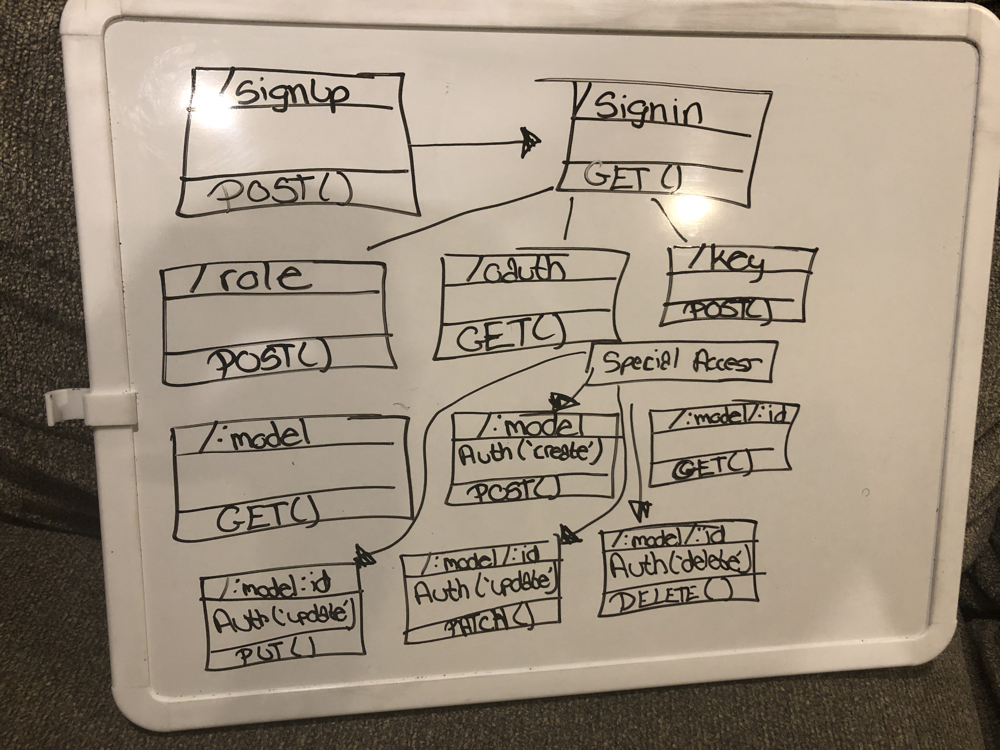

# LAB - 15

## Project Name
Block 3 Project: API Server

### Author: Tia Rose

### Links and Resources
* [submission PR](https://github.com/tia-rose-401-advanced-javascript/lab-15/pull/2)
* [travis](https://www.travis-ci.com/tia-rose-401-advanced-javascript/lab-15)
* [back-end](https://frozen-thicket-57903.herokuapp.com/)

#### Documentation
* [JSDOC](https://frozen-thicket-57903.herokuapp.com)
* [Swagger](https://frozen-thicket-57903.herokuapp.com/api-docs)

#### Modules
* `index.js`
* `src folder`
*   * `api folder`
*   * * `v1.js` - `exports - router`
*   * `auth folder`
*   * * `oauth folder`
*   * * * `google.js` - `exports - authorize`
*   * * `middleware.js` - `exports - auth`
*   * * `roles-model.js` - `exports - rolesSchema`
*   * * `router.js` - `exports - authRouter`
*   * * `users-model.js` - `exports - usersSchema`
*   * * `utils.js` - `exports - utils object containing authbearer, authbasic and authenticate`
*   * `middleware folder`
*   * * `404.js` - `exports - 404 error`
*   * * `500.js` - `exports - 500 error`
*   * * `model-finder.js` - `exports - modelfinder`
*   * `models folder`
*   * * `categories folder`
*   * * * `categories-model.js` - `exports - new categories Schema`
*   * * `players folder`
*   * * * `players-model.js` - `exports - new players Schema`
*   * * * `players-schema.js` - `exports - players Schema`
*   * * `teams folder`
*   * * * `teams-model.js` - `exports - new teams Schema`
*   * * * `teams-schema.js` - `exports - teams Schema`
*   * * `memory-model.js` - `exports - memory model class containing sanintize, count, get by id, post, delete by id and put by id and entry`
*   * * `monngo-model.js` - `exports - mongo model class containing get by id, post, put by id and entry and delete by id`
*   * `app.js`

### Setup
*  `npm i` or `npm install`

#### `.env` requirements - see sample-env or look below
* `PORT` - 3000
* `SECRET` - string
* `MONGODB_URI` - mongodb://localhost:27017/<databasename>
* `TOKEN_TIME` - 15m
* `SINGLE_USE_TOKENS` - false
* `API_URL` - http://localhost:3000
* `GOOGLE_CLIENT_ID` - obtained from google dev console
* `GOOGLE_CLIENT_SECRET` - obtained from google dev console

* `Add Roles with capabilities to db by going to --> localhost:3000/role in postman then adding`

{
	"role": "user",
	"capabilities": ["read"]
}

{
	"role": "editor",
	"capabilities": ["create", "read", "update"]
}

{
	"role": "admin",
	"capabilities": ["create", "read", "update", "delete", "superuser"]
}

#### Running the app
* `npm start`

* Endpoint: `/role`
  * allows adding of roles through this route and postman
* Endpoint: `/signup`
  * route to signup a new user with a username, pwd, email and role/capabilities
* Endpoint: `/signin`
  * route to signin a user with username and pwd
* Endpoint: `/oauth`
  * route to authenticate user throug oauth using their google login info
* Endpoint `//api/v1/:model`
  * get route that gets all for either players, teams or categories
* Endpoint `/api/v1/:model`
  * post route that creates for either players, teams or categories - requires create authentication
* Endpoint `//api/v1/:model/:id`
  * get route that returns a single player, team or category based on id
* Endpoint `/api/v1/:model/:id`
  * put route that updates a single player, team or category based on id - requires update authentication
* Endpoint `/api/v1/:model/:id`
  * patch route that updates a single player, team or category based on id - requires update authentication
* Endpoint `/api/v1/:model/:id`
  * delete route that deletes a single player, team or category based on id - requires delete authentication

#### Tests
* `npm test`

#### UML
